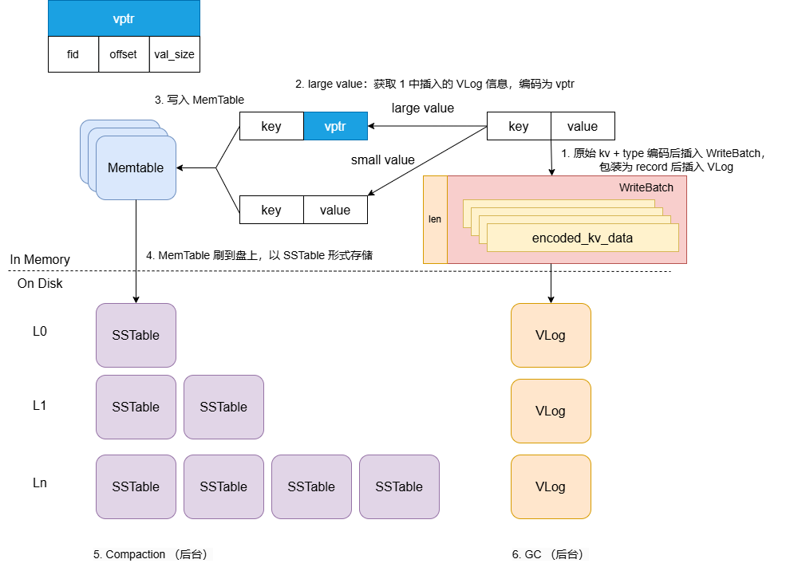
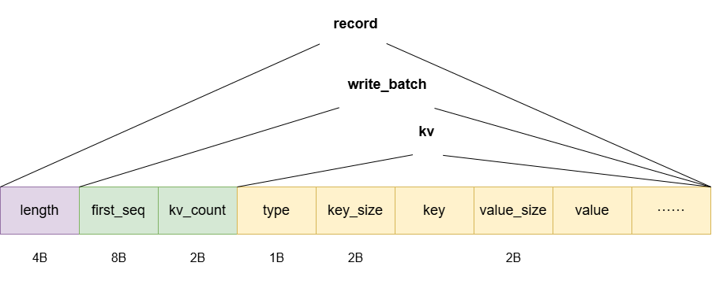
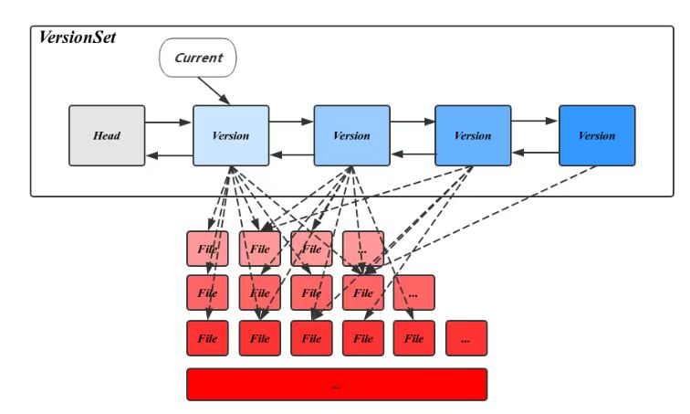
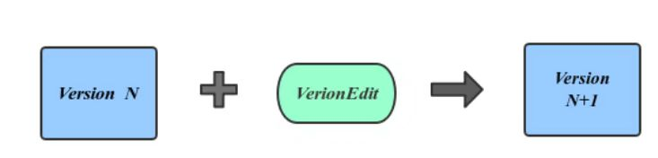
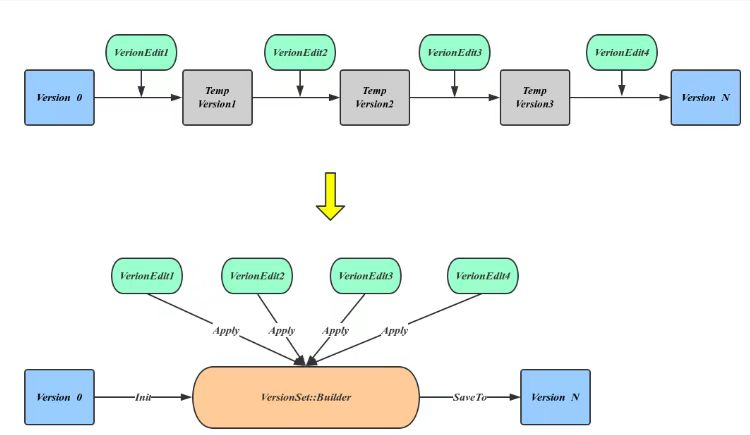
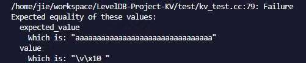
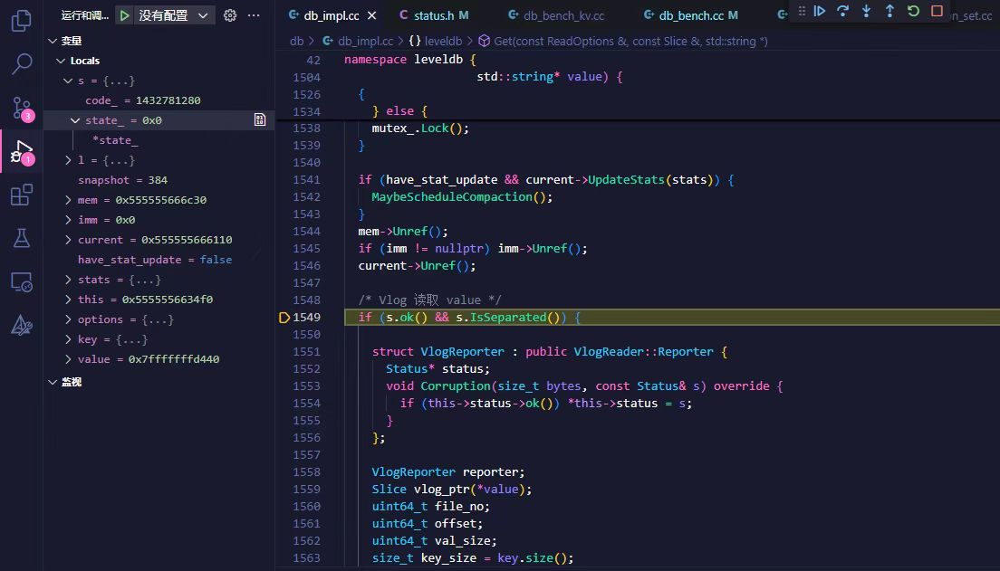

# LevelDB: Value Field & KV Separation 设计文档

<center>
    小组成员：谷杰 10222140408  朱维清 10215300402
</center>

## 项目概述 

>  **项目背景：**LevelDB 项目的 KV 键值对存储信息单一；LSM-Tree 读写放大开销大，导致 LevelDB 顺序范围查询时的数据吞吐量随 Value 大小增加而急剧下降。

#### 项目目标 & 实现目的

1. 实现 LevelDB 的 **value 字段功能**：
   + 实现类似 关系数据库-表格-列 和 文档数据库-文档-字段 的多字段功能设计；
     + **提供高效的接口来读写 value、通过 value 查询多个匹配的 Key**；
   + 使 LevelDB 同时具有 高性能读写大量键值对 和 多字段数据存储 的功能。
2. 实现 **KV 分离（分离存储、点查、范围查询、GC 机制）**：
   + 减小 LevelDB 的读写放大；
   + 减小 LSM-Tree 的层级；
   + Compaction 不需重写 value；
   + 一个 SSTable 的 Block 能存更多 Key，有利于减少读 LSM-Tree 的开销；
   + Cache 能储存更多 SSTable，减少磁盘 I/O 开销。
3. 实现 **Benchmark**，测试并分析性能：
   + 验证功能扩展（value 多字段设计 & KV 分离）的有效性；
   + **评估性能提升（读写 Throughput 性能、读写放大、随机点查/顺序范围查询效率（延迟）、GC 开销与性能影响）**；
   + **分析资源利用率（硬盘 I/O 、内存负载）**；

## 字段设计

+ **设计目标：**
  1. 将 value 设计为一个字段数组，每个元素对应一个字段 `Field`： `field_name: field_value` ；
  2. 对于 value 存储时的字符串类型值与真实含义的字段数组，采用字段数组的序列化与字符串的解析实现两者的转化；
  3. 允许在存储 KV 键值对前修改字段内容；
  4. 允许通过字段值查询所有对应的 key。
+ **实现思路：**
  1. 定义一个` Fields`类来管理`LevelDB`中的字段。其中`Field`是使用标准库中的`std::pair<std::string, std::string>` 定义了单个字段的格式，而`FieldArray`则是使用了`std::vector<Field>` 来定义一组字段。
  2. 定义`fields_`这一私有成员变量，它是一个 `FieldArray` 类型的向量，用来存储一组字段。
  3. 定义一系列的构造函数来支持从不同类型的参数创建`Fields`对象。
  4. 定义了`SortFields`方法来确保在创建`Fields`对象时，各个字段会根据`field_name`从小到大进行排序，进而减少后续更新删除操作中会出现的通过 `field_name` 遍历 `Fields` 的耗时。
  5. 定义了`UpdateField` 和 `UpdateFields` 方法允许用户更新或插入单个或多个字段，以及`DeleteField` 和 `DeleteFields` 方法允许用户删除单个或多个字段。实现思路是通过遍历fields_来查找匹配的field_name并对其进行更新（若不存在则插入）以及删除操作（⭐在上述操作的实现中，由于字段列表的有序性，遍历时可通过比较field_name大小来提前判断该字段是否存在，对于小字段的查找尤其明显，进而有效减少搜索时间，提高搜索效率。）
  6. 定义`SerializeValue` 和 `ParseValue` 方法分别用于将字段序列化为字符串或将字符串反序列化为字段对象。实现时是调用了`conding.h`文件中的`PutLengthPrefixedSlice`函数以及`GetLengthPrefixedSlice`函数，它们的作用分别是对一个`string`进行编码并在其前面加入长度信息和将编码后的`string`中的长度信息去除，提取出原始`string`。这两个函数不仅可以完美实现我们对字段编码的最初设计，同时也和`lsm-tree`里原来所有的`kv`数据对的编码保持一致。
  7. 定义`GetField`和`HasField`方法用于访问特定字段和检查字段是否存在，实现思路与更新删除操作类似，也是对`fields_`进行遍历。
  8. 重载 `[]` 运算符，以提供类似字典的字段访问方式。对于常量对象，`operator[]` 返回字段值的副本，如果给定的字段名不存在，则返回一个空字符串，并输出错误信息。而对于非常量对象，`operator[]` 返回字段值的引用，并允许修改该字段值。如果给定的字段名不存在，则会插入一个新的字段，并返回新字段值的引用。
  9. 定义了一个静态方法`FindKeysByFields` 用于根据若干个字段在数据库中查找对应的键。实现上是使用`LevelDB`提供的`API`创建一个`NewIterator`,从数据库的第一个条目遍历到最后一个条目。事先定义了`find_keys` 来存储找到的键，在遍历过程中，为了避免重复处理同一个键，会先检查当前键是否已经存在于 `find_keys` 中。如果存在，则跳过此条目。若不存在，则提取其`value`部分，利用 `ParseValue` 方法将字符串形式的值解析为 `Fields` 对象，进而获得该条目对应的字段数组。再对解析后的字段数组与`search_fields_`进行匹配，这里支持完全匹配和部分匹配，将匹配的`key`存入`find_keys`中，最后返回`find_keys`。(💡Tips：在使用`Iterator`进行遍历时，`it.key()`和`it.value()`获取的其实是`kv`字符串本身，不需要我们再解码`kv length`和考虑`tag`（`ktypevalue`、`ktypedeletion`）。我们在设计之初并未考虑到这一点，是在后续测试的`debug`中发现了这一情况)

#### 数据结构

+ `class Fields`

  ```c++
    class Fields {
        private:
            FieldArray fields_;
  
        public:
            /* 从 FieldArray 构造 */
            explicit Fields(const FieldArray& fields);
            /* 从单个 Field 构造 */
            explicit Fields(const Field& field);
            /* 只传参 field_name 数组的构造 */
            explicit Fields(const std::vector<std::string>& field_names);
    
            Fields() = default;
            ~Fields() = default;
  
            /* 根据 field_name 从小到大进行排序，减少通过 field_name 遍历 Fields 的耗时 */
            void SortFields();
    
            /* 更新/插入单个字段值，插入后会进行 Fields 排序，减少通过 field_name 遍历 Fields 的耗时 */
            void UpdateField(const std::string& field_name, const std::string& field_value);
            void UpdateField(const Field& field);
            /* 更新/插入多个字段值 */
            void UpdateFields(const std::vector<std::string>& field_names, const std::vector<std::string>& field_values);
            void UpdateFields(const FieldArray& fields);
  
            /* 删除单个字段 */
            void DeleteField(const std::string& field_name);
            /* 删除多个字段 */
            void DeleteFields(const std::vector<std::string>& field_names);
    
            /* 序列化 Field 或 FieldArray 为 value 字符串 */
            /* static 修饰的函数序列化/反序列化无需访问一个 Fields 对象的 fields_ */
            static std::string SerializeValue(const FieldArray& fields);
            static std::string SerializeValue(const Field& field);
            std::string SerializeValue() const;
    
            /* 反序列化 value 字符串为 Fields */
            static Fields ParseValue(const std::string& value_str);
    
            /* 获取字段 */
            Field GetField(const std::string& field_name) const;
            /* 检查字段是否存在 */
            bool HasField(const std::string& field_name) const;
  
            /* 重载运算符 [] 用于访问字段值 */
            std::string operator[](const std::string& field_name) const;
            /* 重载运算符 [] 用于修改字段值 */
            std::string& operator[](const std::string& field_name);
  
            /* 通过若干个字段查询 Key */
            static std::vector<std::string> FindKeysByFields(leveldb::DB* db, const FieldArray& fields);
    };
  ```

#### 字段测试

+ 编写的测试样例包括：字段的排序、批量写入、批量更新、批量删除、序列化/反序列化、包含 LSM-tree 和 KV 分离的 VLogs 范围的 `FindKeysByFields` 功能，全部通过。


## KV 分离

> ​	KV 分离部分，由于我们小组最后定版设计为，使 VLog 代替原 LevelDB 中 WAL 的作用，同时具有从 LSM-Tree 中分离并保存超过某个 value 大小阈值（`separate_threshold`）的 kv 对数据的作用，关于 VLog 的读写类 `VlogReader/VlogWriter` 的实现参考了 `LogReader/LogWriter` 的部分内容，并能共享 `LogReader/LogWriter` 使用的所有读写接口（参见`env_posix.cc`，读写均为磁盘I/O）（去除了 CRC 校验功能）。
>
> + **结构图/写入流程图**：
>   

## VlogReader & VlogWriter

### Vlog 结构图



#### 数据格式

+ **VLog 文件大小：`Options::max_value_log_size = 16 * 1024 * 1024`；**
+ **KV 分离的 value 大小阈值为：`WriteOptions::separate_threshold = 32`；**

```markdown
vlog_record :
    length:        uint16       // record 长度
    first_seq:     uint64       // record 中第一对 kv 对应的 sequence
    kv_count：     uint16       // record 中的 kv 对数
    kv_data:                    // record 保存的 kv 数据

kv_data ：
    type:          uint8         // 是否进行 kv 分离
    key_size:      uint16        // key 的长度    
  	key:                         // key 值
  	value_size:    uint16        // value 的长度
  	value:                       // value 值

LSM-tree 中的 value ：  
	// 若 KV 不分离，value 为原值编码，如需要分离则 value 编码保存为：     
value:
  	fid:           uint64        // 保存该 kv 的 vlog 编号
  	offset:        uint64        // 该 kv 起始位置在 vlog 中的偏移
  	value_size:    uint64        // value 大小 
```

### VlogReader

```c++
class VlogReader {
    public:
        class Reporter {
            public:
                virtual ~Reporter() = default;
                virtual void Corruption(size_t bytes, const Status& status) = 0;
        };
    	
		// 支持随机读与顺序读，提升顺序读取的效率
        explicit VlogReader(SequentialFile* file, Reporter* reporter);
        explicit VlogReader(RandomAccessFile* file, Reporter* reporter);

        VlogReader(const VlogReader&) = delete;
        VlogReader& operator=(const VlogReader&) = delete;

        ~VlogReader();
        // 从 vlog 中读取一条具体的值
        bool ReadValue(uint64_t offset, size_t length, Slice* key_value, char* scratch);
        bool ReadRecord(Slice* record, std::string* scratch);
        // 返回 ReadRecord 函数读取的最后一条 record 的偏移（last_record_offset_）
        uint64_t LastRecordOffset() const;

    private:
        /* 读取 vlog 物理记录（data 部分） */
        bool ReadPhysicalRecord(std::string* result);

        void ReportCorruption(uint64_t bytes, const Status &reason);

        SequentialFile* const file_;
        RandomAccessFile* const file_random_;
        Reporter* const reporter_;
        char* const backing_store_;
        Slice buffer_;
        bool eof_;  // Last Read() indicated EOF by returning < kBlockSize

        // Offset of the last record returned by ReadRecord.
        uint64_t last_record_offset_;
};
```

+ 保留了大部分 `LogReader` 的原函数，但由于 Vlog 的数据结构相对 WAL 有很大改变，譬如直接丢弃原来的 `RecordType` 枚举类型（`kZeroType, kFullType, kFirstType, kMiddleType, kLastType`），下面是几个重要函数的重写（关注 `eof_` 标识符和 VLog 的 Header (只包含 length)，`vHeaderSize = 4`）：
  ```c++
  // 从 vlog 中读取一条具体的值
  bool VlogReader::ReadValue(uint64_t offset, size_t length, Slice *key_value, char *scratch) {
    if (file_random_ == nullptr) {
      return false;
    }
    /* 随机读取一个 RandomAccessFile，使用对应的读接口 Read 函数 */
    Status status = file_random_->Read(offset, length, key_value, scratch);
    if (!status.ok()) {
      return false;
    }
    return true;
  }
  
  bool VlogReader::ReadRecord(Slice *record, std::string *scratch) {
    if (ReadPhysicalRecord(scratch)) {
      *record = *scratch;
      return true;
    }
    return false;
  }
  
  /* 读取 vlog 物理记录（kv_data 部分） */
  bool VlogReader::ReadPhysicalRecord(std::string *result) {
    result->clear();
    buffer_.clear();
  
    char* tmp_head = new char[vHeaderSize];
    /* 顺序读取一个 SequentialFile，使用对应的读接口 Read 函数 */
    Status status = file_->Read(vHeaderSize, &buffer_, tmp_head);
    if (!status.ok()) {
      buffer_.clear();
      ReportCorruption(kBlockSize, status);
      eof_ = true;
      return false;
    } else if (buffer_.size() < vHeaderSize) {
      eof_ = true;
    }
  
    if (!eof_) {
      result->assign(buffer_.data(),buffer_.size());
      uint32_t length = DecodeFixed32(buffer_.data());
      buffer_.clear();
      char* tmp = new char[length];
      status = file_->Read(length, &buffer_, tmp);
      if (status.ok() && buffer_.size() == length) {
        *result += buffer_.ToString();
      } else {
        eof_ = true;
      }
      delete [] tmp;
    }
    delete [] tmp_head;
  
    if (eof_) {
      result->clear();
      return false;
    }
    return true;
  }
  ```

#### 读流程详解

1. 一条传入 key 的读流程发起后，调用起始点是 `DBImpl::Get()` 函数，若成功在 memtable、immutable memtable、SSTables 里找到该 key 对应的 kv 对，且 kv 对的 `type` 为 `kTypeSeparation`：
   ```c++
   Status DBImpl::Get(const ReadOptions& options, const Slice& key,
                      std::string* value) {
                      
     ······
   
     /* Vlog 读取 value */
     if (s.ok() && s.IsSeparated()) {
   
       struct VlogReporter : public VlogReader::Reporter {
         Status* status;
         void Corruption(size_t bytes, const Status& s) override {
           if (this->status->ok()) *this->status = s;
         }
       };
   
       VlogReporter reporter;
       Slice vlog_ptr(*value);
       uint64_t file_no;
       uint64_t offset;
       uint64_t val_size;
       size_t key_size = key.size();
         
       /* 已知该 value 保存在 VLog，解码出 vlog_ptr（fid, offset, val_size）*/
       GetVarint64(&vlog_ptr, &file_no);
       GetVarint64(&vlog_ptr, &offset);
       GetVarint64(&vlog_ptr, &val_size);
       
       /* VLog 内部 kv 对的编码长度，1B 为 type */
       uint64_t encoded_len = 1 + VarintLength(key_size) + key.size() + VarintLength(val_size) + val_size;
   
       std::string fname = LogFileName(dbname_, file_no);
       RandomAccessFile* file;
       s = env_->NewRandomAccessFile(fname,&file);
       if (!s.ok()) {
         return s;
       }
   
       VlogReader vlogReader(file, &reporter);
       Slice key_value;
       char* scratch = new char[encoded_len];
   
       if (vlogReader.ReadValue(offset, encoded_len, &key_value, scratch)) {
         value->clear();
         if (!ParseVlogValue(key_value, key, *value, val_size)) {
           s = Status::Corruption("value in vlog isn't match with given key");
         }
       } else {
         s = Status::Corruption("read vlog error");
       }
   
       delete file;
       file = nullptr;
     }
   
     return s;
   }
   ```

2. VlogReader 读取了 VLog kv 数据对后，对该数据对进行解析，实现很简单，按序解码出 key 和 vlog_value 即可：
   ```C++
   /* 从 VlogReader 读取的 VLog kv 数据对中解析出 value */
   bool DBImpl::ParseVlogValue(Slice key_value, Slice key,
                               std::string& value, uint64_t val_size) {
     Slice k_v = key_value;
     if (k_v[0] != kTypeSeparation) return false;
     k_v.remove_prefix(1);
   
     Slice vlog_key;
     Slice vlog_value;
     if (GetLengthPrefixedSlice(&k_v, &vlog_key)
         && vlog_key == key
         && GetLengthPrefixedSlice(&k_v, &vlog_value)
         && vlog_value.size() == val_size) {
       value = vlog_value.ToString();
       return true;
     } else {
       return false;
     }
   }
   ```

### VlogWriter

```c++
class VlogWriter {
 public:
  // Create a writer that will append data to "*dest".
  // "*dest" must be initially empty.
  // "*dest" must remain live while this Writer is in use.
  explicit VlogWriter(WritableFile* dest);

  // Create a writer that will append data to "*dest".
  // "*dest" must have initial length "dest_length".
  // "*dest" must remain live while this Writer is in use.
  VlogWriter(WritableFile* dest, uint64_t dest_length);

  VlogWriter(const VlogWriter&) = delete;
  VlogWriter& operator=(const VlogWriter&) = delete;

  ~VlogWriter() = default;

  Status AddRecord(const Slice& slice, uint64_t& offset);

 private:
  Status EmitPhysicalRecord(const char* ptr, size_t length, uint64_t& offset);
  size_t head_;
  WritableFile* dest_;
};
```

VlogWriter的设计与LogWriter的设计基本相同，更多的其实是减去了校验码的部分。

AddRecord()即写入一条日志，EmitPhysicalRecord()则是写入缓存区。

head_记录当前文件写入位置（偏移量）以用于计算下一条记录的写入起始位置

```c++
VlogWriter::VlogWriter(WritableFile* dest) : dest_(dest), head_(0) {}

VlogWriter::VlogWriter(WritableFile* dest, uint64_t dest_length)
    : dest_(dest), head_(0) {}

Status VlogWriter::AddRecord(const Slice& slice, uint64_t& offset) {
  const char* ptr = slice.data();
  size_t left = slice.size();
  Status s;
  s = EmitPhysicalRecord(ptr, left, offset);
  return s;
}

Status VlogWriter::EmitPhysicalRecord(const char* ptr, size_t length,
                                      uint64_t& offset) {
  assert(length <= 0xffff);
  char buf[4];
  EncodeFixed32(buf, length);
  Status s = dest_->Append(Slice(buf, 4));
  if (s.ok()) {
    s = dest_->Append(Slice(ptr, length));
    if (s.ok()) {
      s = dest_->Flush();
      offset = head_ + 4;
      head_ += 4 + length;
    }
  }
  return s;
}
```

vlog_writer.cc文件中则是对于构造函数，AddRecord()以及EmitPhysicalRecord()。实现上与LogWriter基本一致，只是去除了Crc校验码的部分。对于EmitPhysicalRecord()函数，由于去除了校验码，则其header要从原本的8字节改为4字节，只保留length部分（4字节）。

改完vlog_writer部分后，让我们重新来梳理一遍写入过程。

对于Put()操作：

```c++
// Convenience methods
Status DBImpl::Put(const WriteOptions& o, const Slice& key, const Slice& val) {
  return DB::Put(o, key, val);
}
```

```c++
Status DB::Put(const WriteOptions& opt, const Slice& key, const Slice& value) {
  WriteBatch batch(opt.separate_threshold);
  batch.Put(key, value);
  return Write(opt, &batch);
}
```

经过一系列函数的调用，最终会来到Write()函数

```c++
Status DBImpl::Write(const WriteOptions& options, WriteBatch* updates) {
  Writer w(&mutex_);
  w.batch = updates;
  w.sync = options.sync;
  w.done = false;

  MutexLock l(&mutex_);
  writers_.push_back(&w);
  while (!w.done && &w != writers_.front()) {
    w.cv.Wait();
  }
  if (w.done) {
    return w.status;
  }

  // May temporarily unlock and wait.
  Status status = MakeRoomForWrite(updates == nullptr);
  uint64_t last_sequence = versions_->LastSequence();
  Writer* last_writer = &w;
  ...
```

首先会生成一个writer对象,带写锁，并对writer进行初始化。

在leveldb中，在面对并发写入时，做了一个处理的优化。在同一个时刻，只允许一个写入操作将内容写入到日志文件以及内存数据库中。为了在写入进程较多的情况下，减少日志文件的小写入，增加整体的写入性能，leveldb将一些“小写入”合并成一个“大写入”。使第一个发起写入的线程作为唯一写者，负责发起写合并、批量化处理来自其他线程的写入操作。

紧接着便是MakeRoomForWrite 方法，判断 Memtable 是不是满了、当前 L0 的 SSTable 是不是太多了，从而发起 Compaction 或者限速。

```c++
...
{
      mutex_.Unlock();
      // 先写入vlog再写入memtable
      // 写vlog日志 offset 表示这个 write_batch 在vlog中的偏移地址。
      uint64_t offset = 0;
      status = vlog_->AddRecord(WriteBatchInternal::Contents(write_batch),offset);
      // status = log_->AddRecord(WriteBatchInternal::Contents(write_batch));
      bool sync_error = false;
      if (status.ok() && options.sync) {
        status = logfile_->Sync();
        if (!status.ok()) {
          sync_error = true;
        }
      }
      if (status.ok()) {
        status = WriteBatchInternal::InsertInto(write_batch, mem_, logfile_number_, offset);
      }
      ...
```

接着是写入Record部分，这里我们做了一个修改，即我们会先写入vlog再写入memtable。

实现上是先调用AddRecord()将Record写入vlog，再调用InsertInto()写如memtable。

对于InsertInto():

```c++
Status WriteBatchInternal::InsertInto(const WriteBatch* b, MemTable* memtable,
                                      uint64_t fid, size_t offset) {
  MemTableInserter inserter;
  inserter.sequence_ = WriteBatchInternal::Sequence(b);
  inserter.mem_ = memtable;
  return b->Iterate(&inserter, fid, offset);
}
```

会调用Iterate():

```c++
Status WriteBatch::Iterate(Handler* handler, uint64_t fid,
                           uint64_t offset) const {
  Slice input(rep_);
  const char* begin = input.data();

  if (input.size() < kHeader) {
    return Status::Corruption("malformed WriteBatch (too small)");
  }
  input.remove_prefix(kHeader);
  Slice key, value;
  int found = 0;
  while (!input.empty()) {
    found++;
    const uint64_t kv_offset = input.data() - begin + offset;
    assert(kv_offset > 0);

    char tag = input[0];
    input.remove_prefix(1);
    switch (tag) {
      case kTypeValue:
        if (GetLengthPrefixedSlice(&input, &key) &&
            GetLengthPrefixedSlice(&input, &value)) {
          handler->Put(key, value);
        } else {
          return Status::Corruption("bad WriteBatch Put");
        }
        break;
      case kTypeDeletion:
        if (GetLengthPrefixedSlice(&input, &key)) {
          handler->Delete(key);
        } else {
          return Status::Corruption("bad WriteBatch Delete");
        }
        break;
      case kTypeSeparation:
        if (GetLengthPrefixedSlice(&input, &key) &&
             GetLengthPrefixedSlice(&input, &(value))) {
          // value = fileNumber + offset + valuesize 采用变长编码的方式
          std::string dest;
          PutVarint64(&dest, fid);
          PutVarint64(&dest, kv_offset);
          PutVarint64(&dest, value.size());
          Slice value_offset(dest);
          handler->Put(key, value_offset, kTypeSeparation);
        } else {
          return Status::Corruption("WriteBatch Put error");
        }
        break;
      default:
        return Status::Corruption("unknown WriteBatch tag");
    }
  }
  if (found != WriteBatchInternal::Count(this)) {
    return Status::Corruption("WriteBatch has wrong count");
  } else {
    return Status::OK();
  }
}
```

在Iterate()中,对于每次操作进行遍历，对于不同的keyType会进行不同的处理，这里我们对于kTypeSeparation类型，即超过阈值需要进行kv分离的键值对，会对value进行修改，使其采用fileNumber + offset + valuesize 变长编码的方式，最后调用Put写入memtable。

### KV 分离读写测试

+ VLog 读写测试文件为 `test/kv_test`，长/短 value 读写均通过测试，KV 分离实现。


## Garbage Collection

> ​	不同于 VLog 已实现 `VlogReader/VlogWriter` 的读写功能，我们设计 VLog 的垃圾回收机制（GC）是基于每个 VLog 的剩下有效 kv 数据对所占 VLog 比重触发的。

#### ValueLogInfo

+ GC 需要知晓每个 VLog 的详细信息，这些信息以结构体 `ValueLogInfo` 的形式保存与访问：

  ```C++
  typedef struct ValueLogInfo {
      uint64_t last_sequence_;            // VLog 中最后一个有效 kv 的序列号
      size_t file_size_;                  // VLog 文件大小
      uint64_t logfile_number_;           // VLog 文件编号
      int left_kv_numbers_;               // VLog 中剩下的 kv 数量
      uint64_t invalid_memory_;           // VLog 中无效空间的大小
  }ValueLogInfo;
  ```

+ 所有 VLog 文件的 `ValueLogInfo` 可以根据对应的 `ValueLogInfo->invalid_memory_` 进行对比，并从小到大保存：

  ```c++
  struct MapCmp{
      bool operator ()(const ValueLogInfo* a, const ValueLogInfo* b)
      {
          return a->invalid_memory_ < b->invalid_memory_;
      }
  };
  ```

### SeparateManagement 类

```C++
class SeparateManagement {
    public:
        SeparateManagement(uint64_t garbage_collection_threshold)
         : garbage_collection_threshold_(garbage_collection_threshold) {}

        ~SeparateManagement() {}
		/* 更新数据库的最后一个序列号，为需要 GC 的 VLog 分配新的序列号 */
        bool ConvertQueue(uint64_t& db_sequence); 
		/* 更新指定 VLogInfo 的无效空间和剩余键值对数量 */
        void UpdateMap(uint64_t fid, uint64_t abandon_memory);
		/* 选择无效空间最大的 VLog 加入到 need_updates_ 队列 */
        void UpdateQueue(uint64_t fid);
		/* 从 garbage_collection_ 队列中取出一个需要 GC 的 VLog，返回最后（最新）序列号 */
        bool GetGarbageCollectionQueue(uint64_t& fid, uint64_t& last_sequence);
		/* 在 map_file_info_ 中添加新创建的 VLog 的 ValueLogInfo */
        void WriteFileMap(uint64_t fid, int kv_numbers, size_t log_memory);
		/* 检查是否有任何 VLog 需要 GC */
        bool MayNeedGarbageCollection() { return !garbage_collection_.empty(); }
		/* 从 map_file_info_ 中移除指定编号的 VLog */
        void RemoveFileFromMap(uint64_t fid) { map_file_info_.erase(fid); }
		/* 检查 map_file_info_ 是否为空 */
        bool EmptyMap() { return map_file_info_.empty(); }
		/* 遍历 map_file_info_ 中的所有 VLog，更新 need_updates_ 以便后续 GC */
        void CollectionMap();

    private:
        // VLog 触发 GC 的阈值
        uint64_t garbage_collection_threshold_;
        // 当前 version 的所有 VLog 索引
        std::unordered_map<uint64_t, ValueLogInfo*> map_file_info_;
        // 即将 GC 的 VLog
        std::deque<ValueLogInfo*> garbage_collection_;
        // 需要 GC 但尚未更新 Sequence 的 VLog
        std::deque<ValueLogInfo*> need_updates_;
		// 正在删除的 VLog 文件编号
        std::unordered_set<uint64_t> delete_files_;
};
```

#### 介绍部分函数

+ `ConvertQueue`：
  每次把 VLog 加入 GC 队列前需要更新数据库的 last_sequence，并确保所有 `need_updates_` 队列里的 VLog 都更新了 `last_sequence_`，以便对 VLog 中的有效 keys 重新插入新的 VLog 中：

```C++
bool SeparateManagement::ConvertQueue(uint64_t& db_sequence) {
    if (!need_updates_.empty()) {
        db_sequence++;
    } else {
        return false;
    }
    while (!need_updates_.empty()) {
        ValueLogInfo* info = need_updates_.front();
        need_updates_.pop_front();
        map_file_info_.erase(info->logfile_number_);
        info->last_sequence_ = db_sequence;
        db_sequence += info->left_kv_numbers_;
        garbage_collection_.push_back(info);
    }
    assert(db_sequence <= kMaxSequenceNumber);
    return true;
}
```

+ `UpdateMap`：每删除一个 KV 分离的 key 时都要对这个 key 对应的 VLog 更新 `invalid_memory_`：

```C++
void SeparateManagement::UpdateMap(uint64_t fid, uint64_t abandon_memory) {
    if (map_file_info_.find(fid) != map_file_info_.end()) {
        ValueLogInfo* info = map_file_info_[fid];
        info->left_kv_numbers_--;
        info->invalid_memory_ += abandon_memory;
    }
}
```

+ `UpdateQueue`：遍历 `map_file_info_` 中所有的 ValueLogInfo，通过优先队列进行排序，找到无效空间最大的 VLog 进行 GC，这个 VLog 要不存在 `delete_files_` 中。加入 GC 队列的 VLog 数量由当前无效空间最多的 VLog 超过 GC 阈值多少决定（1~3），且优先删除比传入 `fid` 更旧的 VLog： 

```C++
void SeparateManagement::UpdateQueue(uint64_t fid) {
    std::priority_queue<ValueLogInfo*, std::vector<ValueLogInfo*>, MapCmp> sort_priority_;

    for (auto iter = map_file_info_.begin(); iter != map_file_info_.end(); ++iter) {
        if (delete_files_.find( iter->first) == delete_files_.end()) {
            sort_priority_.push(iter->second);
        }
    }
    /* 默认每次只把一个 VLog 加入到 GC 队列 */
    int num = 1;
    int threshold = garbage_collection_threshold_;
    if (!sort_priority_.empty()
        && sort_priority_.top()->invalid_memory_ >= garbage_collection_threshold_ * 1.2) {
        /* 如果无效空间最多的 VLog 超过 GC 阈值 20%，这次会把 1~3 个 VLog 加入到 GC 队列  */
        num = 3;
        threshold = garbage_collection_threshold_ * 1.2;
    }
    while (!sort_priority_.empty() && num > 0) {
        ValueLogInfo* info = sort_priority_.top();
        sort_priority_.pop();
        /* 优先删除较旧的 VLog */
        if (info->logfile_number_ > fid) {
            continue;
        }
        num--;
        if (info->invalid_memory_ >= threshold) {
            need_updates_.push_back(info);
            /* 更新准备 GC（准备删除）的 VLog */
            delete_files_.insert(info->logfile_number_);
        }
    }
}
```

+ `CollectionMap()`：把所有当前存活的 VLog 插入 `need_updates_` ，以便未来进行 GC：

```C++
void SeparateManagement::CollectionMap(){
    if (map_file_info_.empty()) return;

    for (auto iter : map_file_info_) {
        uint64_t fid  = iter.first;
        ValueLogInfo* info = iter.second;
        if (delete_files_.find(fid) == delete_files_.end()) {
            need_updates_.push_back(info);
            delete_files_.insert(info->logfile_number_);
        }
    }
}
```

---

### GC 的具体实现

> 1. 我们采用了类似 Compaction 的后台多线程调度机制来实现 GC；
> 2. 支持在线自动 GC，也支持离线手动触发 GC；
> 3. GC 与 Snapshot 互相冲突：若数据库运行期间有 Snapshot 产生，则该 Snapshot 之后的所有数据不再进行任何在线 GC，直到该 Snapshot 被释放才会重启在线 GC；
>
> **VLog 的 GC 的回收阈值： `Options::garbage_collection_threshold = max_value_log_size / 4 ( = 4MB)`**

+ 所有 GC 流程都由 `SeparateManagement *DBImpl::garbage_collection_management_` 进行管理，并向所有 VLogs 的 `ValueLogInfo` 更新 GC 的结果。 

#### 后台多线程调度机制

参考 Compaction 线程互斥锁的实现与后台调度机制：

```c++
  // 用于 gc 的线程互斥锁
  port::CondVar garbage_collection_work_signal_ GUARDED_BY(mutex_);
  // 表示后台 gc 线程是否正被调度
  bool background_GarbageCollection_scheduled_ GUARDED_BY(mutex_);

  // 若为 true 则表示不允许后台 GC 线程继续进行
  bool finish_back_garbage_collection_;

  // 参考 Compaction 的调度机制，对于 GC 也声明：
  // GCBGWork、GCBackgroundCall、MaybeScheduleGC、BackGroundGC
  static void GarbageCollectionBGWork(void* db);
  void GarbageCollectionBackgroundCall();
  void MaybeScheduleGarbageCollection() EXCLUSIVE_LOCKS_REQUIRED(mutex_);
  void BackGroundGarbageCollection();
```

#### 离线手动 GC

```c++
// 注释：手动进行离线回收
Status DBImpl::OutLineGarbageCollection(){
  MutexLock l(&mutex_);
  Status s;
  // map_file_info_ 非空，则根据它进行回收，否则进行所有 VLog 的回收
  if (!garbage_collection_management_->EmptyMap()) {
    garbage_collection_management_->CollectionMap();
    uint64_t last_sequence = versions_->LastSequence();
    garbage_collection_management_->ConvertQueue(last_sequence);
    versions_->SetLastSequence(last_sequence);
    MaybeScheduleGarbageCollection();
    return Status();
  }
  return s;
}
```

### 在线自动 GC 流程

1. 首先需要确定最基本的三点：

   + `SeparateManagement *DBImpl::garbage_collection_management_` 记录了当前数据库的等待 GC 队列 `garbage_collection_` ，而该队列的更新只在 `ConvertQueue(db_sequence)` 函数中触发；
   + `garbage_collection_` 中所有的 `ValueLogInfo` 又都来自于需要进行 GC 但尚未更新 Sequence 的 VLog 队列 `need_updates_`，而该队列的更新只在 `UpdateQueue(fid)` 函数中触发；
   + `need_updates_`是怎么来的？根据我们 GC 的 VLog 无效空间超过设定阈值这样的触发逻辑，我们在 `UpdateMap(fid, abandon_memory)`中进行了上述判断，并对每个 `ValueLogInfo` 的关键成员变量 `left_kv_numbers_` 和 `invalid_memory_` 做了修改；

2. **那么接下来的问题变为：在线自动 GC 会在什么时候调用 `ConvertQueue()` 、 `UpdateQueue()`、`UpdateMap()` 函数？**

   + **`UpdateMap()` ：什么时候会有新的 VLog 无效空间产生？—— LSM-Tree 触发 Compaction，在 `DoCompactionWork()` 中 drop 掉 KV 数据对的时候！（我们设置只有在 drop 掉 type 为 `kTypeSeparation` 的 KV 数据对时才调用 `UpdateMap()` 函数。）**

     ```c++
         if (!drop) {
             
             ······
                 
     	} else {
           // drop 掉 LSM-tree 中的 kv 数值对，对属于 KV 分离的 kv 数值对进行 GC
           Slice drop_value = input->value();
           if( ikey.type == kTypeSeparation ){
             uint64_t fid = 0;
             uint64_t offset = 0;
             uint64_t size = 0;
             GetVarint64(&drop_value,&fid);
             GetVarint64(&drop_value,&offset);
             GetVarint64(&drop_value,&size);
             mutex_.Lock();
             garbage_collection_management_->UpdateMap(fid,size);
             mutex_.Unlock();
           }
         }
     ```

   + **`UpdateQueue()`：什么时候更新 `need_updates_` 合适呢？在 `BackgroundCompaction()` 函数成功调用 `DoCompactionWork()` ，更新完一轮 `ValueLogInfo` 的无效空间之后，调用一次`UpdateQueue()` 来更新 `need_updates_`：**

     ```c++
         // compact 后需要考虑是否将 vlog 文件进行 gc 回收，
         // 如果需要则将其加入到 GC 任务队列中
         // 不进行后台的 gc 回收，那么也不用更新待分配 sequence 的 vlog
         if(!finish_back_garbage_collection_){
             garbage_collection_management_->UpdateQueue(versions_->ImmLogFileNumber() );
         }
     
         CleanupCompaction(compact);
         c->ReleaseInputs();
         RemoveObsoleteFiles();
       }
     ```

   + **`ConvertQueue()`：除了离线手动触发 GC 之外，什么时候更新 `garbage_collection_` 比较合适？我们把该函数的调用放在了 `Write()` 函数中：每有一个 WriteBatch 准备写入 VLog 和 memtable 前，通过 `ConvertQueue(last_sequence)` 来更新一次所有 VLogs 的序列号与数据库的 `last_sequence_`，并触发一次可能的 GC 流程：**

     ```c++
       if (status.ok() && updates != nullptr) {  // nullptr batch is for compactions
         WriteBatch* write_batch = BuildBatchGroup(&last_writer);
     
         // GC 流程中写回的 WriteBatch 在 CollectionValueLog 函数中已经设置好了
         if (!write_batch->IsGarbageColletion()) {
           // 判断是否需要进行 GC
           // 如需要，空出一块 sequence 区域, 触发 GC 将在 MakeRoomForWrite 里
           // 先判断是否要进行 gc 后台回收
           // 如果建立了快照，finish_back_garbage_collection_ 就为 true
           // 此时不进行 sequence 分配
           if (!finish_back_garbage_collection_
               && garbage_collection_management_->ConvertQueue(last_sequence)) {
             MaybeScheduleGarbageCollection();
           }
           // SetSequence 在 write_batch 中写入本次的 sequence
           WriteBatchInternal::SetSequence(write_batch, last_sequence + 1);
           last_sequence += WriteBatchInternal::Count(write_batch);
         }
         // 这里设置 last_sequence 是为了确保离线 GC 的时候，
         // 在 map 存在的时候需要调用 ConvertQueue 给回收任务分配 sequence
         versions_->SetLastSequence(last_sequence);
         vlog_kv_numbers_ += WriteBatchInternal::Count(write_batch);
     ```

3. 与 Compaction 的后台触发流程类似，可能触发一次 GC 的入口函数为 `MaybeScheduleGarbageCollection()`，除了离线手动触发 GC 之外，它共在两处地方可能被调用：

   + `GarbageCollectionBackgroundCall()` 在无法调度后台 GC 线程或是成功开始后台 GC 线程之后调用 `MaybeScheduleGarbageCollection()`；
   + 上文提到的 `Write()` 函数中；

4. 接下来的后台 GC 调度流程参考了 Compaction 的后台调度：

   ```c++
   // 可能调度后台线程进行 GC
   void DBImpl::MaybeScheduleGarbageCollection() {
     mutex_.AssertHeld();
     if (background_GarbageCollection_scheduled_) {
       // Already scheduled
     } else if (shutting_down_.load(std::memory_order_acquire)) {
       // DB is being deleted; no more background compactions
     } else if (!bg_error_.ok()) {
       // Already got an error; no more changes
     } else {
       // 设置调度变量,通过 detach 线程调度; detach 线程即使主线程退出,依然可以正常执行完成
       background_GarbageCollection_scheduled_ = true;
       env_->ScheduleForGarbageCollection(&DBImpl::GarbageCollectionBGWork, this);
     }
   }
   ```

   ```c++
   // 后台 gc 线程中执行的任务
   void DBImpl::GarbageCollectionBGWork(void* db) {
     reinterpret_cast<DBImpl*>(db)->GarbageCollectionBackgroundCall();
   }
   ```

   ```c++
   // 后台 gc 线程执行
   void DBImpl::GarbageCollectionBackgroundCall() {
     assert(background_GarbageCollection_scheduled_);
     if (shutting_down_.load(std::memory_order_acquire)) {
       // No more background work when shutting down.
     } else if (!bg_error_.ok()) {
       // No more background work after a background error.
     } else {
       BackGroundGarbageCollection();
     }
   
     background_GarbageCollection_scheduled_ = false;
     // 再调用 MaybeScheduleGarbageCollection 检查是否需要再次调度
     MaybeScheduleGarbageCollection();
     garbage_collection_work_signal_.SignalAll();
   }
   // end
   ```

   ```c++
   // 后台 GC 任务
   void DBImpl::BackGroundGarbageCollection(){
     uint64_t fid;
     uint64_t last_sequence;
     while( true){
       Log(options_.info_log, "garbage collection file number: %lu", fid);
       if( !garbage_collection_management_->GetGarbageCollectionQueue(fid,last_sequence) ){
         return;
       }
       // 在线的 gc 回收的 sequence 是要提前就分配好的。
       CollectionValueLog(fid,last_sequence);
     }
   }
   ```

5. 在线后台 GC 流程的最后一步是调用 `CollectionValueLog(fid,last_sequence)` 函数，读取并回收一个 vlog 文件。这里使用了 `VLogReader` 的 `ReadRecord()` 函数来顺序读取要回收的目标 VLog 的所有 records，对于每个 record ，解码出其存储的所有 KV 数据对，并对 `kTypeSeparation` 的 KV 数据对进行一次 LSM-tree 的回查（`GetLsm(key, value)` ，实现参考了 `Get()`）：

   + 从 LSM-tree 中找不到 key，说明这个 key 被删除了，vlog 中要丢弃；
   + 找到了 key，但是最新的 kv 对不是 KV 分离的情况，也丢弃；

   ```c++
         ValueType type = static_cast<ValueType>(record[0]);
         record.remove_prefix(1);
         Slice key;
         Slice value;
         std::string get_value;
         GetLengthPrefixedSlice(&record,&key);
         if (type != kTypeDeletion) {
           GetLengthPrefixedSlice(&record,&value);
         }
         if (type != kTypeSeparation) {
           continue;
         }
   
         status = this->GetLsm(key,&get_value);
         // 1. 从 LSM-tree 中找不到 key，说明这个 key 被删除了，vlog中要丢弃
         // 2. 找到了 key，但是最新的 kv 对不是 KV 分离的情况，也丢弃
         if (status.IsNotFound() || !status.IsSeparated()) {
           continue;
         }
         if (!status.ok()) {
           std::cout<<"read the file error "<<std::endl;
           return status;
         }
   
         // 判断是否要丢弃旧值
         Slice get_slice(get_value);
         uint64_t lsm_fid;
         uint64_t lsm_offset;
   
         GetVarint64(&get_slice,&lsm_fid);
         GetVarint64(&get_slice,&lsm_offset);
   
         if (fid == lsm_fid && lsm_offset == kv_offset) {
           batch.Put(key, value);
           ++next_sequence;
           if (kv_offset - size_offset > config::gcWriteBatchSize) {
             Write(opt, &batch);
             batch.Clear();
             batch.setGarbageCollection(true);
             WriteBatchInternal::SetSequence(&batch, next_sequence);
             uint64_t kv_size;
             GetVarint64(&get_slice,&kv_size);
             size_offset = kv_offset + kv_size;
           }
         }
       }
       record_offset += record.data() - head_record_ptr;
     }
     Write(opt, &batch);
   ```

   再把专门设定为 GC 回写的 WriteBatch 写回 VLog 和 memtable；

6. 最后，在 `env_` 和 `garbage_collection_management_` 里彻底删除这个已经被回收的 VLog 文件即可：

   ```c++
     status = env_->RemoveFile(logName);
     if (status.ok()) {
       garbage_collection_management_->RemoveFileFromMap(fid);
     }
   ```

7. 至此，一次在线自动 GC 流程完成。

---

#### GC 与 Snapshot 的冲突机制

```c++
const Snapshot* DBImpl::GetSnapshot() {
  MutexLock l(&mutex_);
  // 建立快照，对快照之后的信息不用进行 GC
  finish_back_garbage_collection_ = true;
  return snapshots_.New(versions_->LastSequence());
}

void DBImpl::ReleaseSnapshot(const Snapshot* snapshot) {
  MutexLock l(&mutex_);
  snapshots_.Delete(static_cast<const SnapshotImpl*>(snapshot));
  // 没有快照，重新进行后台 GC
  if (snapshots_.empty()) {
    finish_back_garbage_collection_ = false;
  }
}
```

---

## 断电恢复

> 实现断电恢复的主要函数为 `DBImpl::Recover()`、`DBImpl::RecoverLogFile`、`DB::Open()`；

### 大致恢复流程

1. 在 `Open()` 打开一个数据库进程后，首先会使用 manifest 文件记录的 versions 进行一次 `Recover()`；

2. `Recover()` 会指定要恢复的最新的 VLog 文件编号：

   ```c++
     for (size_t i = 0; i < filenames.size(); i++) {
       if (ParseFileName(filenames[i], &number, &type)) {
         // begin 注释： max_number 为要恢复的最新的文件编号
         if (number > max_number) max_number = number;
         // expected 里的文件现在依然存在，可以删除
         expected.erase(number);
         // 保存当前已有的 vlog 文件，基于它们进行恢复
         if (type == kLogFile)
           logs.push_back(number);
         // end
       }
     }
   ```

3. `Recover()` 调用 `RecoverLogFile()` 函数逐个恢复找到的 VLog 日志的内容；

4. `RecoverLogFile()` 会根据单个传入的 VLog 文件恢复内存中的数据。如果找到了正确的序列位置 `found_sequence_pos`，就会将 VLog 中记录的操作读取出来，重新写入到 memtable 中。其中最重要的部分是获取 `versions_->ImmLastSequence()` 来设置 `imm_last_sequence` ，通过这一变量来判断上一次断电时的数据库状态，判断是否需要继续处理当前记录：

   ```c++
     //设置 imm_last_sequence
     uint64_t imm_last_sequence = versions_->ImmLastSequence();
     while (reader.ReadRecord(&record, &scratch) && status.ok()) {
       if (record.size() < 20) {
         reporter.Corruption(record.size(),
                             Status::Corruption("log record too small"));
         continue;
       }
       // begin 如果 imm_last_sequence == 0 的话，
       // 那么整个说明没有进行一次 imm 转 sst的情况，所有的 log 文件都需要进行回收
       // 回收编号最大的 log 文件即可
         if( !found_sequence_pos  && imm_last_sequence != 0 ){
           Slice tmp = record;
           tmp.remove_prefix(8);
           uint64_t seq = DecodeFixed64(tmp.data());
           tmp.remove_prefix(8);
           uint64_t kv_numbers = DecodeFixed32(tmp.data());
   
           // 解析出来的 seq 不符合要求跳过。恢复时定位 seq 位置一定要大于等于 versions_->LastSequence()
           if( ( seq + kv_numbers - 1 ) < imm_last_sequence  ) {
               record_offset += record.size();
               continue;
           }else if( ( seq + kv_numbers - 1 ) == imm_last_sequence ){
               // open db 落盘过 sst，再一次打开 db
               found_sequence_pos = true;
               record_offset += record.size();
               continue;
           } else { // open db 之后没有落盘过 sst，然后关闭 db，第二次恢复的时候
               found_sequence_pos = true;
           }
       }
   ```

5. `RecoverLogFile()` 把读取的 VLog 数据通过 WriteBatch 重新写入到 memtable 中，更新 `max_sequence` 以跟踪遇到的最大序列号 `last_seq`。如果 memtable 写满，则将 memtable 持久化为 SSTable，最后落盘修改 `imm_last_sequence`，版本恢复；

6. 回到 `Recover()` 函数，设置最新 `versions_` 的 `last_sequence_`；

7. 回到 `Open()` 函数，在成功 `Recover()` 之后通过 `GetAllValueLog(dbname, logs)` 获取所有 VLogs，最后把 `imm_last_sequence` 设置到新的 manifest 文件当中，即 `RecoverLogFile()` 中判断上一次断电时的数据库状态 imm -> sst 的情况，表示一次成功的全盘恢复。
   `GetAllValueLog()` 函数实现如下：

   ```C++
   // 获取所有 VLogs
   Status DBImpl::GetAllValueLog(std::string dir, std::vector<uint64_t>& logs) {
     logs.clear();
     std::vector<std::string> filenames;
     // 获取 VLogs 列表
     Status s = env_->GetChildren(dir, &filenames);
     if (!s.ok()) {
       return s;
     }
     uint64_t number;
     FileType type;
     for (size_t i = 0; i < filenames.size(); i++) {
       if (ParseFileName(filenames[i], &number, &type)) {
         // 获取所有 .log 文件
         if (type == kLogFile)
           logs.push_back(number);
       }
     }
     return s;
   }
   ```

8. 最后通过 `LogAndApply()` 进行落盘，调用 `RemoveObsoleteFiles()` 删除不再需要的旧文件：

   ```c++
     // Recover 之后，获取所有 VLogs
     std::vector<uint64_t> logs;
     s = impl->GetAllValueLog(dbname, logs);
     sort(logs.begin(),logs.end());
   
     ······
     
     if (s.ok() && save_manifest) {
       edit.SetPrevLogNumber(0);  // No older logs needed after recovery.
       edit.SetLogNumber(impl->logfile_number_);
       // 把 imm_last_sequence 设置到新的 manifest 当中，
       // 即 RecoverLogFile 中判断上一次断电时的数据库状态的 imm -> sst 的情况，
       // 表示一次成功的全盘恢复
       impl->versions_->StartImmLastSequence(true);
       s = impl->versions_->LogAndApply(&edit, &impl->mutex_);
       impl->versions_->StartImmLastSequence(false);
     }
     if (s.ok()) {
       impl->RemoveObsoleteFiles();
       impl->MaybeScheduleCompaction();
     }
   ```


## KV 分离 —— 版本控制

	在讲述我们如何实现kv分离的版本控制前，我们先来回顾一下leveldb的版本控制。
	
	版本控制是LevelDB中至关重要的内容。LevelDB如何能够知道每一层有哪些SST文件；如何快速的定位某条数据所在的SST文件；重启后又是如何恢复到之前的状态的，等等这些关键的问题都需要依赖版本控制模块。对其维护的信息及所起的作用简要概括如下：

- 记录Compaction相关信息，使得Compaction过程能在需要的时候被触发；
- 维护SST文件索引信息及层次信息，为整个LevelDB的读、写、Compaction提供数据结构支持；
- 负责元信息数据的持久化，使得整个库可以从进程重启或机器宕机中恢复到正确的状态；
- 记录LogNumber，Sequence，下一个SST文件编号等状态信息；
- 以版本的方式维护元信息，使得Leveldb内部或外部用户可以以快照的方式使用文件和数据。

	LevelDB用**Version**表示一个版本的元信息，Version中主要包括一个FileMetaData指针的二维数组，分层记录了所有的SST文件信息。**FileMetaData**数据结构用来维护一个文件的元信息，包括文件大小，文件编号，最大最小值，引用计数等，其中引用计数记录了被不同的Version引用的个数，保证被引用中的文件不会被删除。除此之外，Version中还记录了触发Compaction相关的状态信息，这些信息会在读写请求或Compaction过程中被更新。在CompactMemTable和BackgroundCompaction过程中会导致新文件的产生和旧文件的删除。每当这个时候都会有一个新的对应的Version生成，并插入VersionSet链表头部。

	**VersionSet**是一个Version构成的双向链表，这些Version按时间顺序先后产生，记录了当时的元信息，链表头指向当前最新的Version，同时维护了每个Version的引用计数，被引用中的Version不会被删除，其对应的SST文件也因此得以保留，通过这种方式，使得LevelDB可以在一个稳定的快照视图上访问文件。VersionSet中除了Version的双向链表外还会记录一些如LogNumber，Sequence，下一个SST文件编号的状态信息。



	通过上面的描述可以看出，相邻Version之间的不同仅仅是一些文件被删除另一些文件被删除。也就是说将文件变动应用在旧的Version上可以得到新的Version，这也就是Version产生的方式。LevelDB用**VersionEdit**来表示这种相邻Version的差值。



	为了避免进程崩溃或机器宕机导致的数据丢失，LevelDB需要将元信息数据持久化到磁盘，承担这个任务的就是**Manifest**文件。可以看出每当有新的Version产生都需要更新Manifest，很自然的发现这个新增数据正好对应于VersionEdit内容，也就是说Manifest文件记录的是一组VersionEdit值，在Manifest中的一次增量内容称作一个Block。所以恢复元信息的过程也变成了依次应用VersionEdit的过程，这个过程中有大量的中间Version产生，但这些并不是我们所需要的。LevelDB引入VersionSet::Builder来避免这种中间变量，方法是先将所有的VersoinEdit内容整理到VersionBuilder中，然后一次应用产生最终的Version。



	通过对leveldb的版本控制的理解，我们认为kv分离其实也只是在原有的版本控制的基础上，新添了一些特殊情况。如添加对vlog的维护以及一些用于kv分离的参数。我们先从简单的VersoinEdit入手，添加不同version之间可能产生的差值。

`version_edit.h`：

```c++
struct FileMetaData {
  FileMetaData() : refs(0), allowed_seeks(1 << 30), file_size(0) {}

  int refs;
  int allowed_seeks;  // Seeks allowed until compaction
  uint64_t number;
  uint64_t file_size;    // File size in bytes
  InternalKey smallest;  // Smallest internal key served by table
  InternalKey largest;   // Largest internal key served by table
};

// 注释：vlog文件的元数据
struct LogMetaData {
    LogMetaData() : refs(0), allowed_seeks(1 << 30), file_size(0) {}

    int refs;            // 引用计数
    int allowed_seeks;     //当该值为0时,意味着需要进行compaction操作了; 变量allowed_seeks的值在sstable文件加入到version时确定
    uint64_t number;       //文件名相关;sstable文件的名字是 number.ldb
    uint64_t file_size;    //文件大小
    InternalKey smallest;  //最小的key
    InternalKey largest;   //最大的key
};
```

首先是对于vlog文件的元数据，我们仿照了sstable文件元数据的格式，构建了LogMetaData。

同时我们还添加了SetImmLastSequence函数用于设置在后续immemtable转化为sstable时所需的参数imm_last_sequence_。

```c++
 void SetImmLastSequence(SequenceNumber seq,uint64_t fid) {
      has_imm_last_sequence_ = true;
      imm_last_sequence_ = seq;
      imm_log_file_number_ = fid;
  }
```

以及一些私有成员：

```c++
 //注释：是否包含 imm_last_sequence_
  bool has_imm_last_sequence_;
  //注释：恢复log的时候 用来定位memtable 和 immemtabl中的位置
  SequenceNumber imm_last_sequence_;
  //注释：imm_last_sequence 所处在的log文件
  uint64_t imm_log_file_number_;
```

`version_edit.cc`：

新添了两种tag，分别用于记录immemtable到sst的sequence以及恢复immemtable和memtable时在log文件中对应的位置。

```c++
enum Tag {
  kComparator = 1,
  kLogNumber = 2,
  kNextFileNumber = 3,
  kLastSequence = 4,
  kCompactPointer = 5,
  kDeletedFile = 6,
  kNewFile = 7,
  // 8 was used for large value refs
  kPrevLogNumber = 9,
  // 注释： 用于记录immemtable到sst的sequence
  kImmLastSequence = 10,
  // 注释： 用于记录恢复immemtable和memtable时在log文件中对应的位置
  kLogFile = 11
};
```

在void VersionEdit::Clear()中添加对之前私有成员参数的重置。

```c++
  void VersionEdit::Clear() {
  ...
  // 注释：重置为0
  imm_last_sequence_ = 0;
  // 注释：重置为0
  imm_log_file_number_ = 0;
  ...
  // 注释：重置为false
  has_imm_last_sequence_ = false;
  ...
  }
```

EncodeTo() 用于 VersionEdit 持久化，将本 VersionEdit 的所有信息持久化到磁盘的 MANIFEST 文件中。这里也添加了对新添参数的持久化

```c++
if (has_imm_last_sequence_) {
    PutVarint32(dst, kImmLastSequence);
    PutVarint64(dst, imm_last_sequence_);
    PutVarint64(dst, imm_log_file_number_);
  }
```

对于DecodeFrom() 即从MANIFEST 中恢复一个 VersionEdit也是同理。

```c++
 case kImmLastSequence:
          if (GetVarint64(&input, &imm_last_sequence_) && GetVarint64(&input, &imm_log_file_number_)) {
              has_imm_last_sequence_ = true;
          } else {
              msg = "imemtable last sequence number";
          }
          break;
```

修改完VersoinEdit,接着便是对与VersionSet的一些修改。

`version_set.h`：

```c++
  //注释： immemtable转sst的sequence
  uint64_t imm_last_sequence_;
  //注释： 是否保存 imm 转 sst时候的sequence，主要用在 LogAndApply 这个函数当中，用于区分是mior compact 还是 major compact的过程。
  bool save_imm_last_sequence_;
  //注释：imm_last_sequence 所处在的log文件
  uint64_t imm_log_file_number_;
```

首先便是对于一些基本的私有成员的添加，同时也添加了一系列函数用于后续版本控制时调用来设置相关参数。

```c++
  bool SaveImmLastSequence(){ return save_imm_last_sequence_; }
  bool StartImmLastSequence(bool save ){ save_imm_last_sequence_ = save; }
  void SetImmLastSequence( uint64_t seq ){ imm_last_sequence_ = seq; }
  uint64_t ImmLastSequence() const { return imm_last_sequence_; }
  uint64_t ImmLogFileNumber() const { return imm_log_file_number_; }
  void SetImmLogFileNumber( uint64_t fid ){ imm_log_file_number_ = fid; }
```

`version_set.cc`：

接下来便是对版本控制的相关功能点。

首先是对于Saver结构体，我们需要对kv是否分离进行区分。

```c++
enum SaverState {
  kNotFound,
  kFound,
  kDeleted,
  kCorrupt,
};
// 注释：Saver的kv对是否分离
enum SaverSeparate {
    kNotSeparated,
    kSeparated
};

struct Saver {
  // 注释：初始设为不分离
  SaverSeparate separate = kNotSeparated;
  SaverState state;
  const Comparator* ucmp;
  Slice user_key;
  std::string* value;
};
```

紧接着在SaveValue操作中对于key.type进行判断，若果是是kTypeSeparation,则设为kSeparated类型。

```c++
static void SaveValue(void* arg, const Slice& ikey, const Slice& v) {
  Saver* s = reinterpret_cast<Saver*>(arg);
  ParsedInternalKey parsed_key;
  if (!ParseInternalKey(ikey, &parsed_key)) {
    s->state = kCorrupt;
  } else {
    if (s->ucmp->Compare(parsed_key.user_key, s->user_key) == 0) {
      // s->state = (parsed_key.type == kTypeValue) ? kFound : kDeleted;
      s->state = (parsed_key.type == kTypeValue || parsed_key.type == kTypeSeparation) ? kFound : kDeleted;
      if (s->state == kFound) {
        s->value->assign(v.data(), v.size());
        // 注释：如果key.type是kTypeSeparation,则设为kSeparated类型
        s->separate =  ( parsed_key.type == kTypeSeparation ) ? kSeparated : kNotSeparated;
      }
    }
  }
}
```

接下来是对于Get()操作,即在指定版本中，查找一个给定 key 的 value。需要修改的部分其实也就是在Match操作时，添加一个对是否kv分离的判断。

```c++
      // 注释：对于是否kv分离，调用不同的Set函数
      if( state->saver.separate == kSeparated ){
          state->s.SetSeparated();
      } else{
          state->s.SetNotSeparated();
      }
```

接着便是在VersionSet(),LogAndApply()以及Recover()中添加对新添变量的设置，这里就不多加赘述。

```c++
  // 注释：设置imm_last_sequence_和imm_log_file_number_
  if( SaveImmLastSequence() ){
      edit->SetImmLastSequence(imm_last_sequence_,imm_log_file_number_);
  }
```

```c++
 //注释：加上version_edit中添加的参数
 imm_last_sequence_(0),
 imm_log_file_number_(0),
 save_imm_last_sequence_(false),
```

```c++
//注释：修改imm_last_sequence_和imm_log_file_number_
    imm_last_sequence_ = imm_last_sequence;
    imm_log_file_number_ = imm_log_file_number;
```

```c++
  //注释：重置version_edit里添加的参数
  bool have_imm_last_sequence = false;
  uint64_t imm_last_sequence = 0;
  uint64_t imm_log_file_number = 0;
```

```c++
   //注释： 构建当前的Version 回放参数
   if (edit.has_imm_last_sequence_) {
       imm_last_sequence = edit.imm_last_sequence_;
       imm_log_file_number = edit.imm_log_file_number_;
       have_imm_last_sequence = true;
   }
```

同时我们对于会触发version变化的相关操作也进行了修改。

如对于RecoverLogFile操作中，有些情况会触发Compaction，我们需要在memtable落盘时修改imm_last_sequence以用于版本恢复。

```c++
// 注释：mem 落盘修改 imm_last_sequence，版本恢复
      versions_->SetImmLastSequence(mem->GetTailSequence());
      versions_->SetImmLogFileNumber(log_number);
```


## 遇到的问题和 Debug 过程

在本次实验中，我们其实遇到了很多bug，最终都通过不断的调试，查找错误原因并一一解决。由于数量多且当时没有截图导致现在无法准确复现，这里只是举两个例子。

1. 在完成kv分离的操作后，我们发现对于大value的插入读取测试一直存在一个问题。
   我们发现无论我们插入多少条数据，总会找不到最后一条数据。
   一开始我们认为可能是VlogReader或者VlogWriter存在的问题，反复调试后一直没有解决。
   后来我们发现，无论我们读取时是顺序读取还是倒叙读取，亦或是随机读取，都是最后一个插入的数据读取不到，我们认为可能跟sequence有关。终于，我们在db_impl.cc文件中的Write()函数中，发现WriteBatchInternal::SetSequence(write_batch, last_sequence+1)操作上存在一定的逻辑问题，具体的debug结果我们发现sequence是成倍增长且出现错位，于是我们修改了相关sequence的操作，最终成功通过了测试（当时没有截图，无法图片展示debug细节，这里只有展示修改后的代码）：

```c++
if (status.ok() && updates != nullptr) {  // nullptr batch is for compactions
    WriteBatch* write_batch = BuildBatchGroup(&last_writer);
    WriteBatchInternal::SetSequence(write_batch, last_sequence + 1);
    last_sequence += WriteBatchInternal::Count(write_batch);
    if( !write_batch->IsGarbageColletion() ){
      if( !finish_back_garbage_collection_
          && garbage_collection_management_->ConvertQueue(last_sequence) ){
        MaybeScheduleGarbageCollection();
      }
      last_sequence += WriteBatchInternal::Count(write_batch);
    }
    versions_->SetLastSequence(last_sequence);
    WriteBatchInternal::SetSequence(write_batch, last_sequence );
    last_sequence += WriteBatchInternal::Count(write_batch);
    vlog_kv_numbers_ += WriteBatchInternal::Count(write_batch);
```

2. 在进行kv测试时出现了以下报错：



进行调试后我们发现：



是Get()操作进行到图示步骤，if条件判断错误，再结合实际输出的value，我们一开始认为s.ok()判断出错，但是再将if条件分开判断debug时，我们发现是s.IsSeparated()判断出错。但是结合我们实际拿到了value，kv分离应是正常进行的，后续对IsSeparated()进行debug时，我们发现在本来应该是判断code_是否为kSeparated的地方，我们错误的引用了code()导致条件判断与设想不同。修改后最终顺利通过测试。


## Benchmark

+ 测试环境：创建一个10万条kv记录的数据库，其中每条记录的key为16个字节，value为 1KB ，分离的阈值为 16B。

```cmd
LevelDB:    version 1.23
Date:       Sun Jan  5 22:55:59 2025
CPU:        32 * Intel(R) Core(TM) i9-14900HX
CPUCache:   36864 KB
Keys:       16 bytes each
Values:     1024 bytes each (512 bytes after compression)
Entries:    100000
RawSize:    99.2 MB (estimated)
FileSize:   50.4 MB (estimated)
WARNING: Optimization is disabled: benchmarks unnecessarily slow
WARNING: Assertions are enabled; benchmarks unnecessarily slow
WARNING: Snappy compression is not enabled
```

### 写性能：
+ kv不分离：

```cmd
fillseq      :       4.082 micros/op;    4.2 MB/s    
fillsync     :     985.150 micros/op;    0.0 MB/s (100 ops)
fillrandom   :       4.337 micros/op;    4.0 MB/s    
overwrite    :       4.503 micros/op;    3.8 MB/s    
fillgivenseq :       4.472 micros/op;    3.6 MB/s    
fillgivenrandom :       9.076 micros/op;    1.8 MB/s 
```

+ kv分离：

```cmd
fillseq      :       4.153 micros/op;    4.1 MB/s    
fillsync     :    1005.810 micros/op;    0.0 MB/s (100 ops)
fillrandom   :       4.374 micros/op;    3.9 MB/s    
overwrite    :       4.461 micros/op;    3.8 MB/s
fillgivenseq :       4.503 micros/op;    3.6 MB/s    
fillgivenrandom :       4.789 micros/op;    3.4 MB/s 
```

#### 分析结论

1. 对于大value的场景下，若不进行kv分离，LSM tree 中的底层很快就会被占满，需要向上合并，造成频繁的compact，进一步放大了写放大。若是kv分离以后，一个kv对所占用的空间极少，compact的触发的频次下降。减少了写放大，提高了写入的效率。
2. imm 转到 sst 的过程中，后台压缩线程会让主线程进入等待的状态，若不进行kv分离，一个imm很快就被占满，进入压缩状态，后续的put则需要等待。降低了写入效率。
3. 整体上，进行kv分离写入的效率是要好的。这是因为leveldb在大value下的频繁的compact的原因。

### 读性能

+ kv不分离：

```cmd
readrandom   :       2.460 micros/op; (86501 of 100000 found)
readrandom   :       2.096 micros/op; (86354 of 100000 found)
readseq      :       0.258 micros/op;  188.5 MB/s   
readreverse  :       1.250 micros/op;   38.9 MB/s   
findkeysbyfield : 1474764.000 micros/op; (3873 of 10000 found)
```

+ kv分离：

```cmd
readrandom   :      13.775 micros/op; (86501 of 100000 found)
readrandom   :       9.095 micros/op; (86354 of 100000 found)
readseq      :       0.231 micros/op;   90.2 MB/s   
readreverse  :       0.950 micros/op;   22.0 MB/s   
findkeysbyfield :  231171.000 micros/op; (0 of 10000 found)
```

#### 分析结论

1. 对于大value的场景下，kv分离以后，mem, imm, sst中存储的kv对数更多，内存中可缓存的sst也更多了，从概率上看，在内存中找到所需要的key的概率更大。
2. 访问一个sst，可以跳过的kv对数更多，查找的也就更快。更大概率减少了无效的查找。
