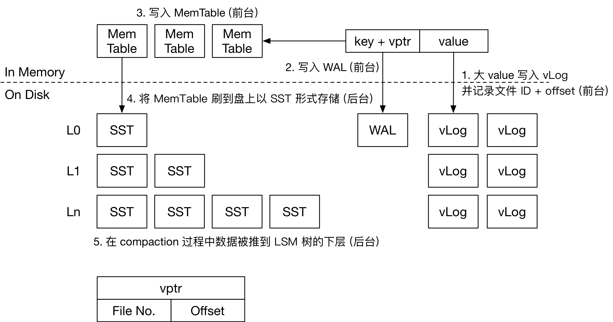

# LevelDB: Value Field & KV Separation 设计文档

## 项目概述 

>  **项目背景：**LevelDB 项目的 KV 键值对存储信息单一；LSM-Tree 读写放大开销大，导致 LevelDB 顺序范围查询时的数据吞吐量随 Value 大小增加而急剧下降。

#### 项目目标 & 实现目的

1. 实现 LevelDB 的 **value 字段功能**：
   + 实现类似 关系数据库-表格-列 和 文档数据库-文档-字段 的多字段功能设计；
     + **提供高效的接口来读写 value、通过 value 查询多个匹配的 Key**；
   + 使 LevelDB 同时具有 高性能读写大量键值对 和 多字段数据存储 的功能。
2. 实现 **KV 分离（分离存储、点查、范围查询、GC 机制）**：
   + 减小 LevelDB 的读写放大；
   + 减小 LSM-Tree 的层级；
   + Compaction 不需重写 value；
   + 一个 SSTable 的 Block 能存更多 Key，有利于减少读 LSM-Tree 的开销；
   + Cache 能储存更多 SSTable，减少磁盘 I/O 开销。
3. 实现 **Benchmark**，测试并分析性能：
   + 验证功能扩展（value 多字段设计 & KV 分离）的有效性；
   + **评估性能提升（读写 Throughput 性能、读写放大、LSM-Tree 层级、随机点查/顺序范围查询效率（延迟）、GC 开销与性能影响、各读写阶段耗时占比 (Wait / Log / Memtable / Other)）**；
   + **分析资源利用率（硬盘 I/O 、内存负载）**；
   + **比较大/小数据集、高并发场景的表现**；
   + 找到性能瓶颈并针对优化。

## 功能设计 

### 2.1  字段设计 

+ **设计目标：**
  1. 将 value 设计为一个字段数组，每个元素对应一个字段 `Field`： `field_name: field_value` ；
  2. 对于 value 存储时的字符串类型值与真实含义的字段数组，采用字段数组的序列化与字符串的解析实现两者的转化；
  3. 允许在存储 KV 键值对前修改字段内容；
  4. 允许通过字段值查询所有对应的 key。
+ **实现思路：**
  1. 设计类 `Fields` 来操作字段数组，与字段相关的字段截取、读写操作、序列化等函数均在 `Fields` 类中实现；
  2. 通过字段查询 Key ：实现函数 `FindKeysByField`，传入若干字段名和字段值（即子字段数组），遍历查找 LSM-Tree 找到对应的若干 key。

### 2.2  KV 分离

+ **设计目标：**
  1. + 对于大 value，分离 KV 存储，减小 LevelDB 的读写放大；
     + 对于小 value，以 KV 键值对的正常形式存入 LSM-Tree；
  2. 对于 vLog 有 GC 机制，可以定期和在 vLog 超出限制大小时触发，回收 vLog 中的失效 value 并更新 vLog 与 LSM-Tree；
  3. 确保操作的原子性。
+ **实现思路：**
  1. vLog 有若干个，**仅保存大于阈值的大 value 对应的 KV 数据对**，且为 Append-Only，仅有一个 vLog 是活跃的（可插入新 value 与 key），**具有一个垃圾计数器，当计数器超过阈值，触发 GC，并被重写**；
  2. 原 LSM-Tree 中的 KV 键值对，**大 value（value 存入 vLog 的情况）改为 `<key, <fileno, offset>>` 的形式；小 value 则与原 LevelDB SSTable 中 KV 键值对存储格式相同**；
  3. 当前活跃的 vLog **超过限制大小**后，新建一个文件作为新的活跃 vLog；
  4. 将大 value 写入当前活跃 vLog 后，获得该 value 在 vLog 的 `offset` 和 vLog 的编号 `fileno` ，将 `<key, <fileno, offset>>` 写入 WAL 和 Memtable 中；
  5. **GC 的触发时机为某个 vLog 的垃圾计数器到达阈值时，GC 过程重写目标 vLog 时，若当前处理的 KV 键值对的 key 在 LSM-Tree 中不存在或已更新，则忽略这个 KV 键值对；**
     + 新的 vLog 被重写完毕后，更新 vLog 中 KV 的新 `<fileno, offset>` 到 LSM-Tree 中；
     + 为了避免以下情况：用户在之前的时间戳删除了 LSM-Tree 中的某个 key，但当前时间戳 GC 导致重写后的 vLog 中的 KV 键值对被回写到 LSM-Tree 中更高层的 SSTable，相当于该 key 对应的 KV 键值对被额外重新插入了，新写入数据在旧写入数据下层的问题——每次读取数据需要遍历查找每一层的所有 SSTable。

## 数据结构设计 

### 3.1  字段功能

+ `Field` & `FieldArray`：
  `using Field = std::pair<std::string, std::string>;`
  `using FieldArray = std::vector<std::pair<std::string, std::string>>;`
+ `class Fields`，用于操作字段数组。

### 3.2  KV 分离



## 接口/函数设计 

### 4.1  字段功能

+ `class Fields`

  ```c++
    class Fields {
        private:
            FieldArray fields_;

        public:
            /* 从 FieldArray 构造 */
            explicit Fields(const FieldArray& fields);
            /* 从单个 Field 构造 */
            explicit Fields(const Field& field);
            /* 只传参 field_name 数组的构造 */
            explicit Fields(const std::vector<std::string>& field_names);
    
            Fields() = default;
            ~Fields() = default;
  
            /* 根据 field_name 从小到大进行排序，减少通过 field_name 遍历 Fields 的耗时 */
            void SortFields();
    
            /* 更新/插入单个字段值，插入后会进行 Fields 排序，减少通过 field_name 遍历 Fields 的耗时 */
            void UpdateField(const std::string& field_name, const std::string& field_value);
            void UpdateField(const Field& field);
            /* 更新/插入多个字段值 */
            void UpdateFields(const std::vector<std::string>& field_names, const std::vector<std::string>& field_values);
            void UpdateFields(const FieldArray& fields);
  
            /* 删除单个字段 */
            void DeleteField(const std::string& field_name);
            /* 删除多个字段 */
            void DeleteFields(const std::vector<std::string>& field_names);
    
            /* 序列化 Field 或 FieldArray 为 value 字符串 */
            /* static 修饰的函数序列化/反序列化无需访问一个 Fields 对象的 fields_ */
            static std::string SerializeValue(const FieldArray& fields);
            static std::string SerializeValue(const Field& field);
            std::string SerializeValue() const;
    
            /* 反序列化 value 字符串为 Fields */
            static Fields ParseValue(const std::string& value_str);
    
            /* 获取字段 */
            Field GetField(const std::string& field_name) const;
            /* 检查字段是否存在 */
            bool HasField(const std::string& field_name) const;
  
            /* 重载运算符 [] 用于访问字段值 */
            std::string operator[](const std::string& field_name) const;
            /* 重载运算符 [] 用于修改字段值 */
            std::string& operator[](const std::string& field_name);
    };
  ```

### 4.2  KV 分离

+ 大 value 的 key 对应的 value 存储位置：`VPtr`
  ```c++
  struct VPtr {
      int fileno;      // VLog 文件号
      uint64_t offset; // 偏移量
  };
  ```

+ `class VLog`

  ```c++
  class VLog {
  private:
      // 该 VLog 是否活跃，即可插值
      bool activate_;
      
      // 最大 VLog 大小
      std::size_t maxSize_;
      
      // GC 计数器
      std::size_t deadkeyCount;
      
  public:
      // 构造函数，默认赋值 GC 计数器为 GC 触发的最大阈值
      VLog(bool activate, std::size_t maxSize, std::size_t gcThreshold)
          : activate_(activate), maxSize_(maxSize), deadkeyCount(gcThreshold) {}
      
      // 向 VLog 中添加一个新的键值对
      virtual void append(const std::string& key, const std::string& value) = 0;
      
      // 查找给定键对应的值
      virtual VPtr lookup(const std::string& key) const = 0;
      
      // 执行垃圾回收操作
      virtual void GarbageCollection() = 0;
      
      virtual ~VLog() {}
  };
  ```

## 功能测试 

### 单元测试（测试用例）

+ **字段功能：**
  1. （测试是否能序列化 `FieldArray`、反序列化解析 value ；）
  2. 测试是否能成功写入、点查与范围查询；
  3. 测试是否能通过 value 查询所有匹配的 Key。
+ **KV 分离：**
  1. 测试大小 value 与对应 key 是否按规则存入 LSM-Tree 或 VLog；
  2. 测试是否能通过 key 与 `VPtr` 找到 VLog 中正确的 value；
  3. 测试 GC 流程是否正确，包括是否成功触发、重写 VLog、回写 LSM-Tree 的 key 对应的 `VPtr`。

### 性能测试（Benchmark）

1. 测试不同 value 大小的 Throughput；
2. 测试读写放大的减小程度；
3. 测试随着插入数据量，LSM-Tree 层级的减小程度；
4. 测试随机点查 / 顺序范围查询效率；
5. 测试 GC 开销；
6. 测试各读写阶段耗时占比（Wait / Log / Memtable / Other）；
7. 比较大/小数据集、高并发场景的表现；
8. （比较资源利用率（硬盘 I/O 、内存负载）；）

## 可能遇到的挑战与解决方案 

1. KV 分离中 VLog 的 GC 开销可能较大：GC 过程中需要扫描和重写 vLog，以及回写 LSM-Tree，需要遍历所有 SSTable，开销较大；
2. 数据一致性问题：若程序突然停止运行，可能导致数据不一致的情况，目前暂时没想到恢复机制；
3. 读、写、GC 等流程的持锁处理；
4. 由于每次读取需要遍历整个 LSM-Tree 且由于 vLog 是 Append-Only 的无序存储，导致顺序读取的效率可能不比随机读取高多少，开销大，需要实现 value 预读机制，提前预读取下一个 value。

## 分工和进度安排

|                     功能                     | 预计完成日期 |     分工     |
| :------------------------------------------: | :----------: | :----------: |
|           Fields 类和相关接口实现            |   12月3日    | 朱维清、谷杰 |
|               测试实现字段功能               |   12月5日    |     谷杰     |
|            VLog 类和相关接口实现             |   12月15日   | 朱维清、谷杰 |
|               测试实现 KV 分离               |   12月19日   |    朱维清    |
| Benchmark 测试（吞吐量、写放大、点查范围查） |   12月26日   |     谷杰     |
| Benchmark 测试（GC 开销、大小数据集、并发）  |   12月26日   |    朱维清    |